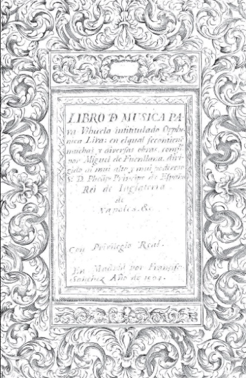
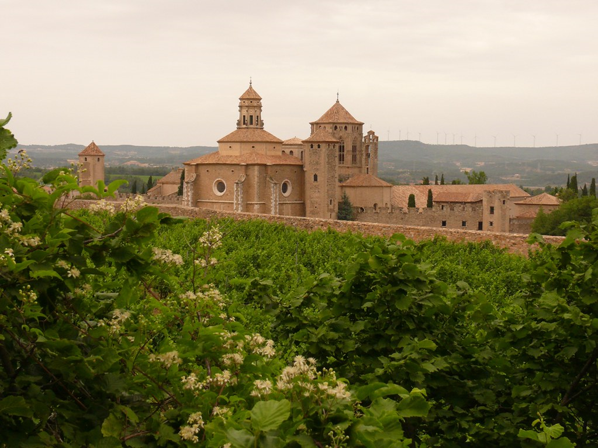
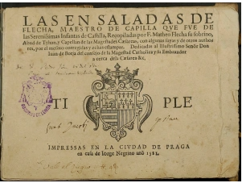
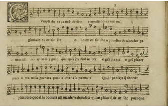

## Contenidos de la presentación

\tableofcontents

# Mateo Flecha

## Vida

-  La biografía actual de Mateo Flecha el Viejo, autor clave del género vocal hispano de la ensalada, está construida sobre escasos datos fehacientes, que dejan grandes lagunas en el conocimiento de su trayectoria profesional.

\vspace{0.1cm}
\centering
{ width=10% }\
\vspace{0.2cm}

### Es decir:

Se conocen datos de dos períodos, **1526-1531 y 1539-1541**, pero el resto de su biografía continúa en la oscuridad. Sus obras más importantes fueron "Las Ensaladas". 

## Nombre

### Mateo Flecha:

"_El nombre de Mateo Flecha, llamado modernamente “el Viejo” para distinguirlo de su sobrino
homónimo, está íntimamente unido al género literario-musical hispano de la ensalada. La trascendencia
del autor en la historia del género así como el prestigio del que disfrutó ya en su época se traslucen con
sólo comprobar la notable cantidad de obras conservadas y de fuentes que las transmiten._"[^1].

[^1]: Villanueva Serrano, F. (2009). Mateo Flecha el Vieno en la Catedral de Valencia: sus dos período de magisterio de capilla(1526-1531? Y
1539-1541) y su entorno musical. Anuario Musical, 64, pp. 57-108.

## Datos conocidos

::: {.columns}

:::: {.column}

- Lo que se conoce de su vida:

	1. Nació en **1481 en Prades (Tarragona)** (Corona de Aragón). 
	2. **Mateu Fletxa el Vell** es su nombre en catalán. Se le sobrellama "el Viejo" para distinguirlo de su sobrino, Mateo Flecha el Joven, también compositor.
	3. Se cree que trabajó desde **septiembre de 1523 hasta octubre de 1525 como maestro de capilla**, en la **Catedral de Lérida**.
	

::::

:::: {.column}

  4. Se piensa que se trasladó a Valencia y trabajó para el duque de Calabria, pues tres de sus obras aparecen en el Cancionero del duque de Calabria (Cancionero de Upsala).
  5. Se cree que después trabajó como masestro de capilla en Sigüenza, **de 1537 a 1539** y después **de 1544 a 1548** trabajó en el **castillo de Arévalo** para las hermanas menores de Felipe II (Infantas María y Juana de Castilla).
  6. Entró en la Ordel Císter y **murió en el Monasterio de Poblet en 1553**.

::::

:::

## Monasterio de Poblet

\centering
{ width=70% }\

# Las Ensaladas

## Qué es una "Ensalada"

### Sebastián de Covarrubias en el Tesoro de la Lengua Castellana o Española (1611):
_“Y porque en la ensalada echan muchas yerbas diferentes, carnes saladas, pescados, azeytunas, conservas, confituras, yemas de huevos, flor de borraja, grageas y de mucha diversidad de cosas se haze un plato, llamaron ensaladas un genero de canciones que tienen diversos metros, y son como centones, recogidos de diversos Autores.
Éstas componen los Maestros de Capilla, para celebrar las fiestas de la Natividad; y tenemos de los Autores antiguos muchas y muy buenas, como el molino, la bomba, el fuego, la justa”._[^2]

[^2]: Covarrubias, Sebastián de (1611). Tesoro de la Lengua castellana o española. Disponible en: <http://bdh.bne.es/bnesearch/detalle/4216062>

\vspace{0.2cm}

### TIPOS DE ENSALADAS:
- obras que se conoce que han existido pero que se han perdido.
- **obras que han sobrevivido y que se conservan total o parcialemente**

## Definición de Ensaladas en el Tesoro de Covarrubias

\centering
{ width=70% }\

# Ensaladas conocidas

## OBRAS QUE HAN SOBREVIVIDO PARCIALMENTE O ESTÁN PERDIDAS:

::: {.columns}

:::: {.column}

### Parciales o desaparecidas:

Las ensaladas fueron recopiladas y publicadas en Praga, (1581), por su sobrino Mateo Flecha el Joven. De las once ensaladas que compuso, sólo seis nos han llegado completas. De las restantes falta una voz. *El cantate* se da por perdida, ya que su sobrino no quiso publicarla por considerarla demasiado larga.

::::
:::: {.column}

\vspace{0.6cm}
\centering

- Las obras a las que falta una voz o están perdidas son:
\vspace{0.2cm}
 	1. El Cantante (perdida)
 	2. La Caça
 	3. La Viuda
 	4. La Caña
 	5. Los Chistes	 
::::
:::

## OBRAS QUE HAN SOBREVIVIDO

::: {.columns}
:::: {.column}
### Principales ensaladas supervivientes

- Las ensaladas que nos han llegado completas :
	- La Negrina
	- La Guerra
	- El Fuego
	- La Justa
	- El Jubilate
	- La Bomba
::::
:::: {.column}

\centering
{ width=90% }\
::::
:::

## Manuscritos

------------------------------------------------------------------
    Obra               Voces       Fuentes         
----------------     ---------    ------------------------
    El Fuego              4          CAI, CII

    La Bomba              4          CMM, CAI, CII

    La Guerra             4          CAI, CII

    La Negrina            4          CAI
------------------------------------------------------------------
 
- CAI - Barcelona, Biblioteca de Cataluña, Ms 588 I
- CII - Barcelona, Biblioteca de Cataluña, Ms 588 II
- CMM - Palma de Mallorca, Fundación Bartolomé March (olim Madrid, Biblioteca Privada de Bartolomé March Servera, R. 6829 (861); olim Biblioteca de la Casa del Duque de Medinaceli, MS 13230) (Cancionero de Medinaceli).

# Referencias
## Referencias

- Covarrubias, Sebastián de (1611). Tesoro de la Lenguua castellana o española. Disponible en: <http://bdh.bne.es/bnesearch/detalle/4216062>
- Villanueva Serrano, F. (2009). Mateo Flecha el Vieno en la Catedral de Valencia: sus dos período de magisterio de capilla(1526-1531? Y 1539-1541) y su entorno musical. Anuario Musical, 64, pp. 57-108.